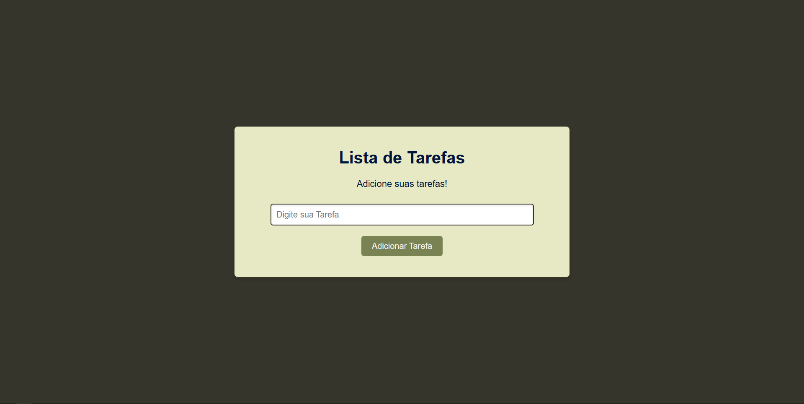

# Projeto: Lista de Tarefas Interativa
Este é um projeto de Lista de Tarefas simples e funcional, desenvolvido com HTML, CSS e, principalmente, JavaScript. O objetivo central deste trabalho foi aprofundar e demonstrar habilidades em lógica de programação através da manipulação do DOM e do gerenciamento de dados no lado do cliente.

## 💻 Tecnologias Empregadas
- HTML5: Para a estruturação semântica e acessível da interface do usuário.
- CSS3: Para a estilização visual, garantindo um design limpo e responsivo.
- JavaScript (ES6+): O coração do projeto, responsável por toda a interatividade e funcionalidade da lista de tarefas.

## ✨ Principais Funcionalidades
Adição de Tarefas: Permite ao usuário adicionar novas tarefas à lista.
Remoção de Tarefas: Possibilita a exclusão individual de tarefas da lista.

## 💡 Destaque na Lógica JavaScript
Este projeto foi uma excelente oportunidade para aplicar e reforçar conceitos fundamentais de JavaScript, tais como:
- Manipulação do DOM: Criação, atualização e remoção dinâmica de elementos HTML.
- Tratamento de Eventos: Implementação de event listeners para reagir às interações do usuário (cliques, submissões de formulário).
- Estruturas de Dados: Utilização de arrays para gerenciar a coleção de tarefas.
- Funções e Modularidade: Organização do código em funções reutilizáveis para melhor legibilidade e manutenção.
- Condicionais e Laços de Repetição: Controle do fluxo do programa para gerenciar o estado das tarefas e renderizar a interface.

## 🚀 Como Executar o Projeto
1. Clone este repositório: git clone https://github.com/Thiagow10/lista-de-tarefas.git
2. Navegue até o diretório do projeto: cd lista-de-tarefas
3.  Abra o arquivo index.html em seu navegador web preferido.
Você pode simplesmente arrastar o arquivo para a janela do navegador ou usar uma extensão como "Live Server" (para VS Code) para uma experiência de desenvolvimento mais conveniente.

## 🤝 Contribuições
Sinta-se à vontade para inspecionar o código, sugerir melhorias ou relatar quaisquer problemas. Sua contribuição é valorizada!
